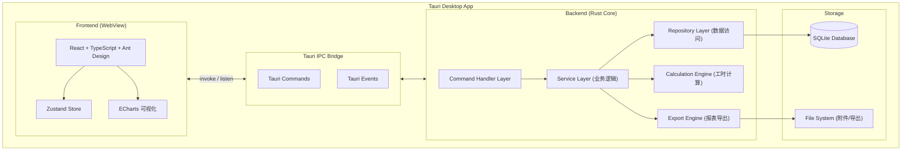
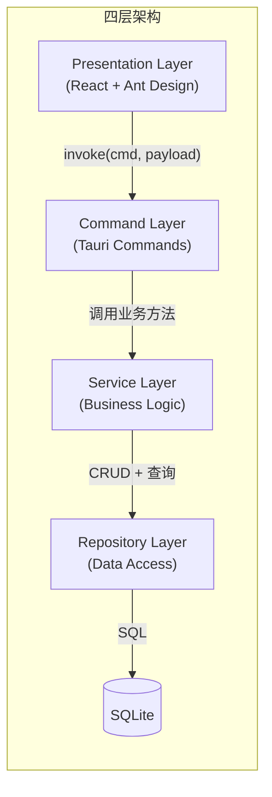
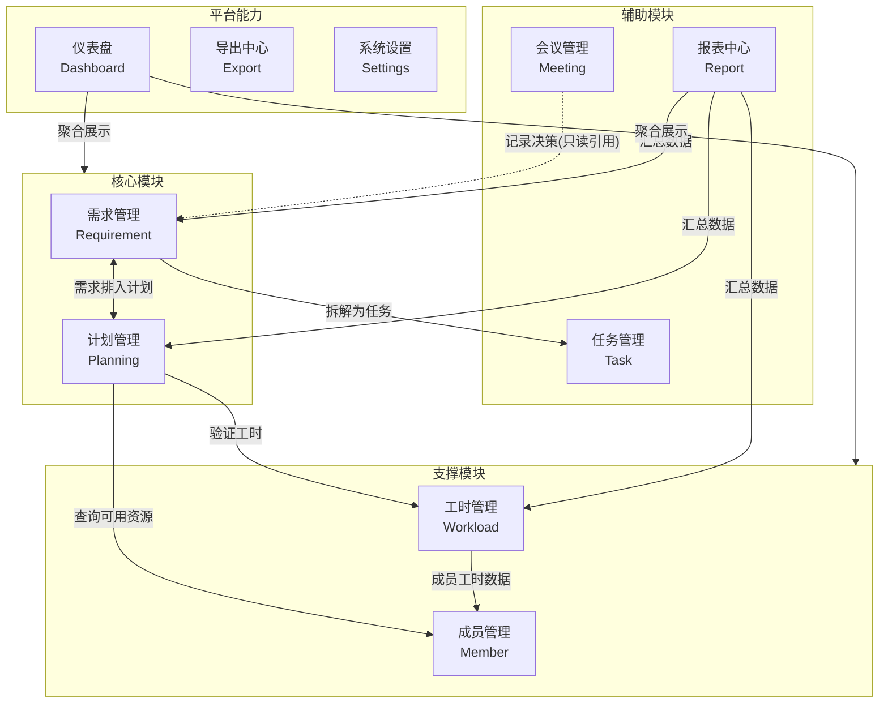
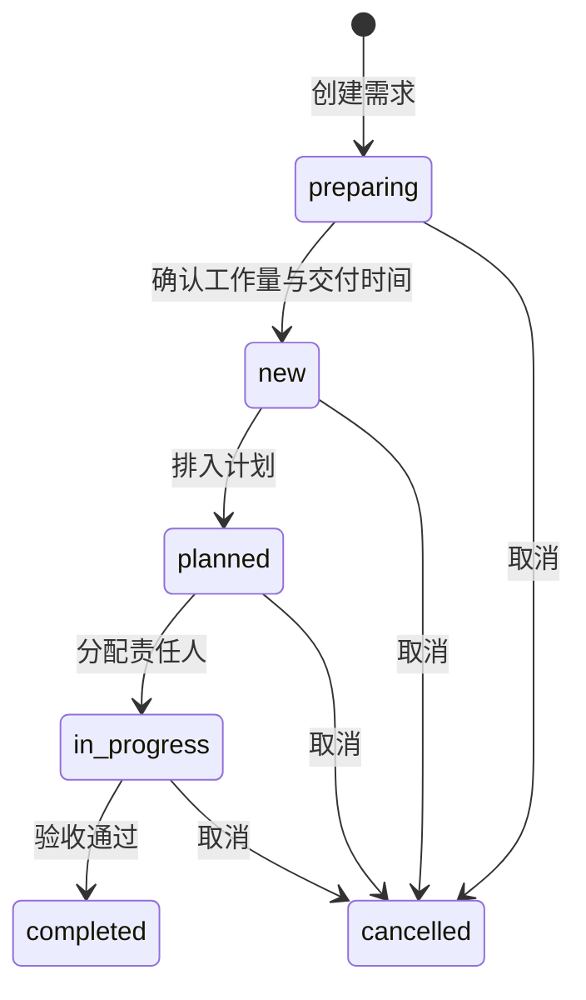
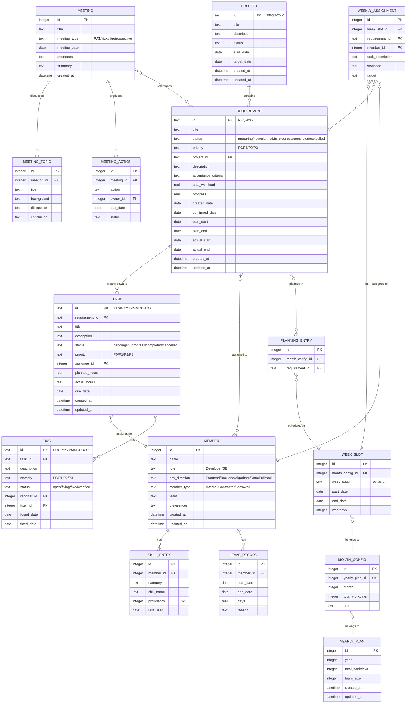
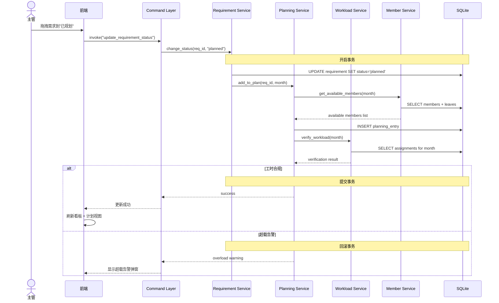
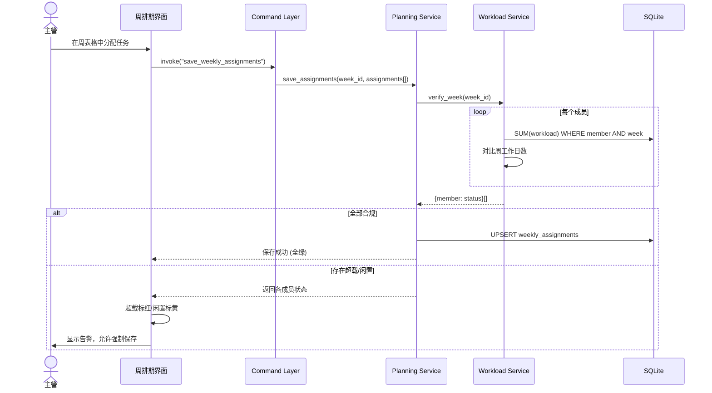

# PPLOps - Personal Project & People Operations

> 研发团队主管的个人 DevOps 桌面端工具，用于管控项目进展、团队成员、任务分配与工时负荷。

---

## 1. 项目背景与目标

### 1.1 痛点分析

当前基于纯 Markdown + YAML 的文本管理体系存在以下问题：


| 痛点      | 表现                          | 根因           |
| ------- | --------------------------- | ------------ |
| 报表难修改   | Markdown 表格增删列困难，对齐易出错      | 文本格式不适合结构化数据 |
| 发散性修改   | 改一个需求状态需联动更新 INDEX、计划、成员等多处 | 数据冗余，无单一数据源  |
| 工时计算人工化 | 每次排期需手动汇总验证                 | 缺少自动化计算引擎    |
| 视图单一    | 看板、甘特图、负荷图等无法在 Markdown 中实现 | 纯文本表达力有限     |
| 数据一致性差  | YAML 与 MD 双向同步脚本易出错         | 数据分散在多个文件    |


### 1.2 目标定位

PPLOps 是一个**单机桌面应用**，面向研发团队主管（单人使用），核心目标：

1. **需求全生命周期管理** -- 从创建到交付的完整流转
2. **计划与人力管理** -- 年度/月度/周度排期，工时自动计算与超载告警
3. **团队资源管理** -- 成员档案、技能矩阵、可用工时
4. **可视化仪表盘** -- 看板、甘特图、负荷热力图等多维视图

系统以**全新空库**启动，不承载从旧 Markdown/YAML 文档库迁移历史数据的职责；数据在应用内从零录入或通过通用导出/备份能力另行管理。

---

## 2. 技术选型

### 2.1 总体技术栈


| 层级         | 技术                    | 理由                             |
| ---------- | --------------------- | ------------------------------ |
| **桌面框架**   | Tauri 2.x             | Rust 后端 + Web 前端，体积小，性能高，安全性好  |
| **后端语言**   | Rust                  | 类型安全，高性能，Tauri 原生语言            |
| **前端框架**   | React 18 + TypeScript | 生态成熟，组件丰富，类型安全                 |
| **UI 组件库** | Ant Design 5.x        | 表格/表单/看板组件完善，企业级 UI            |
| **样式方案**   | TailwindCSS 4         | 原子化 CSS，快速定制主题                 |
| **构建工具**   | Vite 6                | 极速 HMR，Tauri 官方推荐              |
| **数据库**    | SQLite (via rusqlite) | 嵌入式、零部署、单文件、支持事务               |
| **ORM**    | sea-orm               | Rust 异步 ORM，支持 SQLite，**schema 迁移**（建表/改表版本管理） |
| **状态管理**   | Zustand               | 轻量、TypeScript 友好、无 boilerplate |
| **图表库**    | Apache ECharts        | 甘特图、热力图、饼图等可视化需求               |
| **拖拽**     | dnd-kit               | React 拖拽库，支持看板/排期拖拽            |


### 2.2 数据库选型详述

**选择 SQLite 的理由：**


| 考量维度    | SQLite               | 其他备选                   | 结论       |
| ------- | -------------------- | ---------------------- | -------- |
| 部署复杂度   | 零部署，单文件              | PostgreSQL/MySQL 需安装服务 | SQLite 胜 |
| 单用户场景   | 完美匹配                 | 服务端数据库是杀鸡用牛刀           | SQLite 胜 |
| 数据量级    | 百级需求 + 千级任务，远在承受范围内  | 无优势                    | 均可       |
| 备份恢复    | 拷贝单个 `.db` 文件即可      | 需 dump/restore         | SQLite 胜 |
| Rust 生态 | rusqlite 成熟稳定        | diesel 也支持 SQLite      | 均可       |
| 事务支持    | 支持 ACID              | -                      | 满足       |
| Schema 版本管理 | sea-orm-migration 支持 | -                      | 满足       |
| 全文搜索    | FTS5 扩展              | -                      | 满足       |


---

## 3. 系统架构

### 3.1 整体架构图




### 3.2 分层架构说明




| 层级               | 职责                    | 技术实现                         |
| ---------------- | --------------------- | ---------------------------- |
| **Presentation** | 用户界面、交互、可视化           | React + Ant Design + ECharts |
| **Command**      | IPC 接口定义、参数校验、序列化     | Tauri `#[tauri::command]`    |
| **Service**      | 核心业务逻辑、状态流转、工时计算、级联更新 | Rust structs + traits        |
| **Repository**   | 数据持久化、SQL 查询、事务管理     | sea-orm + rusqlite           |


---

## 4. 功能模块设计

### 4.1 模块总览




### 4.2 各模块功能详述

#### 4.2.1 需求管理 (Requirement)

**对应原 skill: `requirement-ops`**


| 功能    | 说明                         |
| ----- | -------------------------- |
| 需求创建  | 表单化创建，字段约束校验，自动分配 REQ-ID   |
| 状态流转  | 可视化状态机，流转时触发级联操作（更新计划、索引）  |
| 需求看板  | 按状态分列的看板视图，支持拖拽流转          |
| 需求列表  | 可排序、筛选、分组的表格视图             |
| 需求详情  | 完整的需求信息展示与编辑（概述、工作量、验收标准等） |
| 工作量估算 | 内嵌工作量评估表，自动汇总              |
| 关联关系  | 需求-项目、需求-任务、需求-成员 的关联维护    |
| 归档管理  | 已完成/已取消需求归档，与活跃需求分离        |


**需求状态流转：**




#### 4.2.2 计划管理 (Planning)

**对应原 skill: `planning-ops`**


| 功能     | 说明                   |
| ------ | -------------------- |
| 年度计划总览 | 12 个月的需求排期鸟瞰视图       |
| 月度计划编辑 | 按月展示需求分配，支持拖入/移出需求   |
| 周任务分配  | 具体到人的周级任务分配表（核心排期界面） |
| 甘特图视图  | 需求/任务的时间线甘特图         |
| 日历联动   | 工作日/节假日/调休日历管理       |
| 工时自动校验 | 排期时实时计算并告警超载/闲置      |
| 计划版本   | 计划变更历史记录，支持回溯        |


#### 4.2.3 成员管理 (Member)

**对应原 skill: `member-ops`**


| 功能     | 说明                   |
| ------ | -------------------- |
| 成员档案   | 基本信息、角色、开发方向、所属小组    |
| 技能矩阵   | 可视化技能雷达图/热力图，1-5 级评分 |
| 请假管理   | 记录请假/调休，影响可用工时计算     |
| 可用资源查询 | 按时间段查询团队可用人力         |
| 成员工作台  | 查看某成员当前所有任务与负荷       |
| 成员类型   | 自有员工/外包/借调 分类管理      |


#### 4.2.4 工时管理 (Workload)

**对应原 skill: `workload-ops`**


| 功能   | 说明                    |
| ---- | --------------------- |
| 负荷总览 | 团队级负荷热力图（按人 x 按周）     |
| 超载检测 | 实时检测并标红超载成员/超载周       |
| 闲置检测 | 标黄未满载的成员/周，提醒补充任务     |
| 精确计算 | 严格按工作日数计算，禁止估算        |
| 负荷报表 | 按月/按季度导出负荷统计          |
| 约束规则 | 可配置的工时约束（标准工作日数、加班日等） |


**负荷热力图示意：**

```
成员 \ 周  | W1(5d) | W2(5d) | W3(5d) | W4(6d) | W5(5d) |
-----------|--------|--------|--------|--------|--------|
成员甲     |  5.0   |  5.0   |  5.0   |  6.0   |  5.0   |  -- 满载
成员乙     |  5.0   |  5.0   |  5.0   |  6.0   |  5.0   |  -- 满载
成员丙     |  5.0   |  3.0   |  5.0   |  6.0   |  5.0   |  -- W2 闲置
成员丁     |  5.0   |  5.0   |  7.0   |  6.0   |  5.0   |  -- W3 超载!
```

#### 4.2.5 任务管理 (Task)

**对应原 skill: `task-ops`**


| 功能     | 说明                   |
| ------ | -------------------- |
| 任务创建   | 从需求拆解任务，自动关联         |
| 任务看板   | 待开始 / 进行中 / 已完成 三列看板 |
| Bug 管理 | Bug 严重程度 P0-P3，关联任务  |
| 工时记录   | 计划工时 vs 实际工时对比       |
| 子任务    | 支持任务分解为子任务           |
| 任务依赖   | 可视化任务依赖关系            |


#### 4.2.6 会议管理 (Meeting)

**对应原 skill: `meeting-ops`**


| 功能          | 说明                      |
| ----------- | ----------------------- |
| 会议记录        | RAT 会议 / 开工会 / 回顾会 三种类型 |
| 议题管理        | 结构化录入讨论点和结论             |
| 决策追踪        | 记录决策及负责人                |
| Action Item | 会后待办事项（只记录，不驱动状态变更）     |
| 关联需求        | 会议中讨论的需求引用（只读）          |


#### 4.2.7 报表中心 (Report)

**对应原 skill: `report-ops`**


| 功能    | 说明                           |
| ----- | ---------------------------- |
| 仪表盘   | 项目全局概览：需求管道、负荷分布、进度统计        |
| 周报汇总  | 自动汇总团队周报数据                   |
| 月度报告  | 月度需求完成率、工时利用率                |
| 自定义报表 | 按条件筛选生成报表                    |
| 导出    | 支持导出为 Markdown / Excel / PDF |


---

## 5. 数据库设计

### 5.1 ER 关系图




### 5.2 核心表说明


| 表名                   | 用途              |
| -------------------- | --------------- |
| `project`            | 项目信息            |
| `requirement`        | 需求池             |
| `requirement_member` | 需求与成员的多对多关联（负责人、参与人） |
| `member`             | 团队成员            |
| `skill_entry`        | 成员技能条目          |
| `leave_record`       | 请假记录，用于可用工时计算   |
| `yearly_plan`        | 年度计划元数据         |
| `month_config`       | 月度工作日与备注        |
| `week_slot`          | 周时间槽（日期范围、工作日数） |
| `weekly_assignment`  | 周级任务与人天分配       |
| `planning_entry`     | 月度内已规划需求条目      |
| `task`               | 任务              |
| `bug`                | Bug             |
| `meeting`            | 会议记录            |
| `meeting_topic`      | 会议议题            |
| `meeting_action`     | 会后待办            |


---

## 6. 项目结构

```
pplops/
├── src-tauri/                     # Rust 后端
│   ├── Cargo.toml
│   ├── tauri.conf.json
│   ├── src/
│   │   ├── main.rs                # 入口
│   │   ├── lib.rs                 # 库入口
│   │   ├── commands/              # Tauri Command 层
│   │   │   ├── mod.rs
│   │   │   ├── requirement.rs     # 需求相关命令
│   │   │   ├── planning.rs        # 计划相关命令
│   │   │   ├── member.rs          # 成员相关命令
│   │   │   ├── workload.rs        # 工时相关命令
│   │   │   ├── task.rs            # 任务相关命令
│   │   │   ├── meeting.rs         # 会议相关命令
│   │   │   └── report.rs          # 报表相关命令
│   │   ├── services/              # 业务逻辑层
│   │   │   ├── mod.rs
│   │   │   ├── requirement.rs
│   │   │   ├── planning.rs
│   │   │   ├── member.rs
│   │   │   ├── workload.rs        # 工时计算引擎
│   │   │   ├── task.rs
│   │   │   ├── meeting.rs
│   │   │   └── report.rs
│   │   ├── repositories/          # 数据访问层
│   │   │   ├── mod.rs
│   │   │   ├── requirement.rs
│   │   │   ├── planning.rs
│   │   │   ├── member.rs
│   │   │   ├── task.rs
│   │   │   └── meeting.rs
│   │   ├── models/                # 数据模型 (sea-orm entities)
│   │   │   ├── mod.rs
│   │   │   ├── requirement.rs
│   │   │   ├── project.rs
│   │   │   ├── member.rs
│   │   │   ├── planning.rs
│   │   │   ├── task.rs
│   │   │   ├── meeting.rs
│   │   │   └── common.rs          # 枚举、共享类型
│   │   ├── migration/             # schema 迁移（表结构版本，非业务数据导入）
│   │   │   ├── mod.rs
│   │   │   └── m20260327_000001_init.rs
│   │   └── error.rs               # 统一错误处理
│   └── migrations/                # sea-orm schema 迁移 SQL
│
├── src/                           # 前端源码
│   ├── main.tsx                   # 入口
│   ├── App.tsx                    # 根组件 + 路由
│   ├── api/                       # Tauri invoke 封装
│   │   ├── requirement.ts
│   │   ├── planning.ts
│   │   ├── member.ts
│   │   ├── workload.ts
│   │   ├── task.ts
│   │   ├── meeting.ts
│   │   └── report.ts
│   ├── stores/                    # Zustand 状态管理
│   │   ├── requirementStore.ts
│   │   ├── planningStore.ts
│   │   ├── memberStore.ts
│   │   └── appStore.ts
│   ├── pages/                     # 页面
│   │   ├── Dashboard/             # 仪表盘
│   │   ├── Requirements/          # 需求管理 (列表 + 看板 + 详情)
│   │   ├── Planning/              # 计划管理 (年度 + 月度 + 周度 + 甘特图)
│   │   ├── Members/               # 成员管理 (列表 + 详情 + 技能矩阵)
│   │   ├── Tasks/                 # 任务管理 (看板 + 列表)
│   │   ├── Workload/              # 工时管理 (热力图 + 报表)
│   │   ├── Meetings/              # 会议管理
│   │   ├── Reports/               # 报表中心
│   │   └── Settings/              # 系统设置
│   ├── components/                # 共享组件
│   │   ├── Layout/                # 布局组件 (侧边栏 + 顶栏)
│   │   ├── KanbanBoard/           # 通用看板组件
│   │   ├── GanttChart/            # 甘特图组件
│   │   ├── HeatMap/               # 热力图组件
│   │   ├── StatusBadge/           # 状态标签组件
│   │   └── WorkloadIndicator/     # 负荷指示器 (绿/黄/红)
│   ├── hooks/                     # 自定义 Hooks
│   ├── types/                     # TypeScript 类型定义
│   │   ├── requirement.ts
│   │   ├── planning.ts
│   │   ├── member.ts
│   │   └── common.ts
│   └── utils/                     # 工具函数
│       ├── workload.ts            # 前端工时计算工具
│       └── format.ts              # 格式化工具
│
├── package.json
├── tsconfig.json
├── vite.config.ts
├── tailwind.config.ts
├── index.html
└── architecture.md                # 本文档
```

---

## 7. 核心业务流程

### 7.1 需求排入计划流程（级联操作）

此流程是原系统中"发散性修改"问题的根源，PPLOps 通过数据库事务实现原子化级联：




### 7.2 周任务分配流程




---

## 8. 前端页面设计

### 8.1 页面路由结构


| 路由                       | 页面                 | 说明                  |
| ------------------------ | ------------------ | ------------------- |
| `/`                      | Dashboard          | 仪表盘首页               |
| `/requirements`          | Requirements List  | 需求列表（表格视图）          |
| `/requirements/board`    | Requirements Board | 需求看板（状态列）           |
| `/requirements/:id`      | Requirement Detail | 需求详情与编辑             |
| `/planning`              | Planning Overview  | 年度计划总览              |
| `/planning/month/:month` | Monthly Plan       | 月度计划详情              |
| `/planning/week/:weekId` | Weekly Assignment  | 周任务分配表              |
| `/planning/gantt`        | Gantt Chart        | 甘特图视图               |
| `/members`               | Member List        | 成员列表                |
| `/members/:id`           | Member Detail      | 成员详情（档案 + 技能 + 工作台） |
| `/members/skills`        | Skills Matrix      | 团队技能矩阵              |
| `/tasks`                 | Task Board         | 任务看板                |
| `/tasks/:id`             | Task Detail        | 任务详情                |
| `/workload`              | Workload Overview  | 工时负荷总览（热力图）         |
| `/workload/verify`       | Workload Verify    | 工时校验报告              |
| `/meetings`              | Meeting List       | 会议列表                |
| `/meetings/:id`          | Meeting Detail     | 会议详情                |
| `/reports`               | Reports Center     | 报表中心                |
| `/settings`              | Settings           | 系统设置                |


### 8.2 仪表盘布局

```
+----------------------------------------------------------------+
| PPLOps                                          [用户名] [设置] |
+--------+-------------------------------------------------------+
|        |  Dashboard                                 2026-03-27  |
|  导航   |-------------------------------------------------------|
|        |  [需求管道]           [本月进度]          [团队负荷]     |
|  仪表盘 |  preparing: 0       完成: 3/11          满载: 7/10    |
|  需求   |  new: 11            进行中: 8           超载: 1       |
|  计划   |  planned: 0         86% ███████░░       闲置: 2       |
|  成员   |  in_progress: 0                                      |
|  任务   |-------------------------------------------------------|
|  工时   |  [本周任务分配 - W4(3月)]                              |
|  会议   |  +-----------+--------+--------+--------+------+      |
|  报表   |  | 成员      | REQ-021| REQ-022| REQ-024| 合计 |      |
|        |  +-----------+--------+--------+--------+------+      |
|  ----  |  | 成员甲    |  6.0   |        |        | 6.0  |      |
|  设置   |  | 成员乙    |        |  6.0   |        | 6.0  |      |
|        |  | 成员丙    |        |        |  6.0   | 6.0  |      |
|        |  | 成员丁    |        |        |  6.0   | 6.0  |      |
|        |  +-----------+--------+--------+--------+------+      |
|        |-------------------------------------------------------|
|        |  [需求负荷分布 - 饼图]    [月度趋势 - 折线图]          |
+--------+-------------------------------------------------------+
```

---

## 9. 关键设计决策

### 9.1 数据一致性保证


| 问题     | 原 MD 方案            | PPLOps 方案               |
| ------ | ------------------ | ----------------------- |
| 需求状态变更 | 需手动更新 5+ 个文件       | 数据库事务，一次提交原子完成          |
| 工时汇总   | Python 脚本计算        | SQL `SUM()` + Rust 校验引擎 |
| 索引维护   | 脚本扫描重建             | 数据库外键 + JOIN 查询，无需索引文件  |
| 计划同步   | YAML <-> MD 双向同步脚本 | 单一数据源（SQLite），UI 直接渲染   |


### 9.2 性能设计


| 场景    | 策略              |
| ----- | --------------- |
| 列表加载  | 分页查询 + 虚拟滚动     |
| 看板拖拽  | 乐观更新 + 异步持久化    |
| 工时计算  | SQL 聚合查询，避免全量加载 |
| 大报表导出 | 后台线程生成，完成后通知前端  |


### 9.3 数据备份与恢复


| 功能           | 实现                                           |
| ------------ | -------------------------------------------- |
| 手动备份         | 复制 `pplops.db` 文件                            |
| 自动备份         | 应用启动时自动备份上一次数据库                              |
| 导出为 Markdown | 支持将需求、计划等导出为 Markdown 报告或片段，便于归档与分享        |
| 数据库位置        | 默认 `%APPDATA%/pplops/data/pplops.db`，可在设置中修改 |


---

## 10. 迭代计划建议

### Phase 1: MVP 基础骨架

- Tauri + React 项目脚手架搭建
- SQLite 空库创建与 **schema 迁移**（用 sea-orm migration 维护表结构版本；与「历史数据迁移」无关）
- 成员管理 CRUD
- 需求管理 CRUD + 状态流转

### Phase 2: 计划与工时核心

- 年度/月度/周度计划管理
- 周任务分配表
- 工时计算引擎与超载校验
- 负荷热力图

### Phase 3: 可视化与报表

- 仪表盘
- 需求看板（拖拽）
- 甘特图
- 技能矩阵雷达图
- 报表导出

### Phase 4: 辅助功能完善

- 任务管理 + Bug 追踪
- 会议管理
- 系统设置
- 自动备份

---

## 11. 技术风险与应对


| 风险                    | 影响               | 应对策略               |
| --------------------- | ---------------- | ------------------ |
| Tauri 2.x Windows 兼容性 | 部分 API 行为差异      | 开发中持续在 Windows 上测试 |
| SQLite 并发写入           | 单用户场景基本不存在       | WAL 模式开启即可         |
| 前端图表性能                | 大数据量下 ECharts 卡顿 | 按需加载，虚拟化，数据聚合    |


---

## 附录: 与 Markdown 管理流程的概念对应

以下说明 PPLOps 各模块与原先在 Markdown 文档库中通过 Skills 与目录约定所承载的**管理职责**之间的对应关系，便于理解产品设计来源；**不表示**需要从旧文档库迁移数据。


| 原概念（Markdown 工作流） | PPLOps 模块      | 变化说明                              |
| ----------------- | -------------- | --------------------------------- |
| `requirement-ops` | Requirement 模块 | 表单化替代 front-matter，看板替代状态扫描脚本     |
| `planning-ops`    | Planning 模块    | 数据库替代 YAML 分层文件，甘特图替代 Markdown 表格 |
| `workload-ops`    | Workload 模块    | SQL 聚合替代 Python 脚本计算，热力图替代文本报表    |
| `member-ops`      | Member 模块      | 结构化表单替代 Markdown 档案，雷达图替代技能表格     |
| `task-ops`        | Task 模块        | 看板 + 表格替代 Markdown 文件             |
| `meeting-ops`     | Meeting 模块     | 结构化表单替代 Markdown 模板               |
| `report-ops`      | Report 模块      | 自动聚合替代汇总脚本，多格式导出                  |
| `system-dev`      | Settings 模块    | 图形化配置替代直接编辑项目根目录说明/配置文档       |
| `_indices/`       | 数据库 JOIN 查询    | 无需维护独立索引文件                        |
| `_templates/`     | 前端表单组件         | 模板逻辑内化为表单校验规则                     |
| `_views/`         | 前端页面视图         | Dataview 查询替换为 SQL + React 渲染     |


